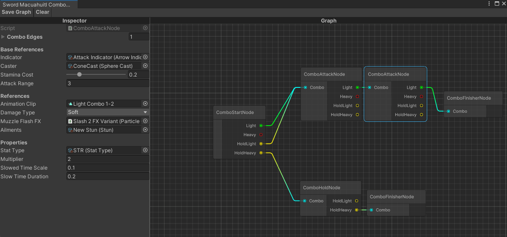

## Generic Graph Editor

This library was made for being able to easily design combo system for the combat of a roguelike project. You can extend the generic classes for different use case to create brand new graph views.

## Combo Graph

Split view was used for editing node values in the graph view.

